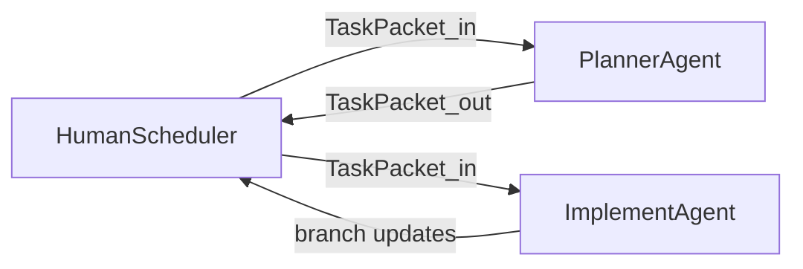

# 多 Agent 协作手册（路由 + TaskPacket）

> **用途**：人类调度者只需告诉各 Agent：**先读本页中与你角色对应的一节**，再按 TaskPacket 开工。  
> **UI 与工程事实来源**：[`app-shell-design-spec.md`](app-shell-design-spec.md)、[`ai-vibe-coding-guide.md`](ai-vibe-coding-guide.md)。  
> **发布层级定义**：[`docs/roadmap/release-targets.md`](../roadmap/release-targets.md)。

---

## 角色路由（你该读哪里）

| 角色 | 必读 | 可选延伸 |
|------|------|----------|
| **Orchestrator（调度者）** | [§ Orchestrator](#orchestrator调度者) · [§ TaskPacket schema](#taskpacket-schema) | [`release-targets.md`](../roadmap/release-targets.md)、[`overview.md`](../roadmap/overview.md) |
| **Planner** | [§ Planner Agent](#planner-agent) · [§ TaskPacket schema](#taskpacket-schema) | [`phase3-planning.md`](../roadmap/milestones/phase3-planning.md) |
| **Implement** | [§ Implement Agent](#implement-agent) · [§ TaskPacket schema](#taskpacket-schema) | design-spec、ai-vibe-coding-guide、[`protocols/README.md`](../protocols/README.md) |

## 任务入口（调度者只需发链接）

- **R1 TaskPacket 队列**：`docs/development/taskpackets/r1-queue.md`

---

## 协作流（谁把什么交给谁）



**文档化交接**：Planner 产出的 TaskPacket 应可复制到聊天或 Issue；当前流程 **不要求 PR**，以 **分支**作为交付载体与隔离边界。

---

## 全局约束（所有 Agent）

- **交付主线**：优先端到端可交付能力（工作区 + 任务 + 协作流闭环）；**不主动扩展协议**。若必须改契约：**先**改 [`packages/event-contracts`](../../packages/event-contracts) 与 [`docs/protocols/`](../protocols/)，**再**改实现。
- **UI**：遵守 design-spec；**禁止**引入 Ant Design、MUI、shadcn 等重型组件库，除非 TaskPacket 显式豁免。
- **路线图**：[`docs/roadmap/overview.md`](../roadmap/overview.md)；稳定/GA 细项 [`phase3-planning.md`](../roadmap/milestones/phase3-planning.md)。R1 不与 M3.1类大规模存储/冲突主线并行。

---

## TaskPacket schema

Planner **必须填满**下列字段；Implement **仅在字段齐全时**开工（缺失则拒绝或要求 Planner 补全）。

```text
id: <short-slug>
r_tier: R1 | R2 | R3
target_role: Implement
goal: <one sentence>
scope_paths: <glob or list, allowlist>
forbidden: <bullet list>
acceptance: <commands + manual steps, verifiable>
design_refs: <e.g. app-shell-design-spec.md §n; or N/A>
base_branch: <e.g. origin/main>
notes: <links, prior decisions>
```

---

## Planner Agent

### 规则

- **输出物**：仅 **TaskPacket**、依赖顺序说明、**R1/R2/R3** 标签；不提交应用代码（除非项目另有约定）。
- **范围**：每个 TaskPacket **单一主题**；`scope_paths` 为白名单；**禁止项**在 `forbidden` 中显式列出（例如「不改 event-contracts」）。
- **并行**：并行任务须在 TaskPacket 中声明 **无文件冲突**；合并冲突风险高时，先发「仅合并 + CI」包，再发功能包。
- **基线**：每个 TaskPacket 注明 `base_branch`。

### 任务（队列维护）

1. 维护 R1 缺口列表，拆成独立 TaskPacket（e2e/验收文档、web-console 与 design-spec 对齐、Host 侧体验等）。
2. R2 起：从 `phase3-planning` 挑选用户可感条目逐包派发；**M3.1 大迁移单独成包**且不与 R1 核心包并行。
3. 影响面不清时，Planner 自行做最小只读梳理并把范围写进 TaskPacket（仍保持单一主题与最小 diff）。

---

## Implement Agent

### 规则

- **输入**：带齐 `id`、`scope_paths`、`acceptance`、`base_branch` 的 TaskPacket。
- **代码**：改动限制在 `scope_paths`；最小 diff；匹配仓库风格与类型；UI 只用 **token**，无组件内硬编码色值（design-spec 已声明的例外除外）。
- **React**：禁止在 render 中触发 `setState`；副作用进 `useEffect`；遵守项目 ESLint。
- **验证**：提交前执行 TaskPacket 中的 `acceptance`（至少 `pnpm lint`、`pnpm typecheck`；涉及则 `pnpm e2e`、`pnpm sync:smoke` 等）。

### 禁止

- 擅自扩大协议、擅自引入 UI 库、无 TaskPacket 的顺手重构。

---

## 分支管理（当前工作法：仅 Planner + Implement）

> 本项目当前阶段：**只按分支管理交付**，暂不要求 PR / Review / Explore 流程。

### 约定

- **分支命名**：`task/<id>`（例如 `task/merge-app-shell-react-baseline`）。
- **从基线开分支**：`base_branch` 作为唯一基线（默认 `origin/main`，以 TaskPacket 为准）。
- **交付方式**：Implement 将变更推到对应 `task/<id>` 分支，并在聊天中回报：分支名 + 已完成的 `acceptance` 摘要。
- **合并策略**：由调度者决定何时合并回主线（本阶段可以先积累多个 `task/*` 分支，按冲突风险排序合并）。
- **并行规则**：只有当 TaskPacket 明确写了「无文件冲突」或范围互不重叠时才允许并行开工。

---

## Orchestrator（调度者）

### 职责

- 将 Planner 产出的 TaskPacket 分发给 Implement 会话。
- 维护分支与合并顺序；**仅对无冲突的 TaskPacket 并行派发**。

### 指示其他 Agent 的最低格式

- **Implement**：「你是 Implement Agent；遵守 [`agent-playbook.md` Implement 一节](#implement-agent)。以下 TaskPacket 为唯一范围与验收依据。」+ 粘贴完整 TaskPacket。

---

## 验收命令参考（与 CI 对齐）

以下与 `.github/workflows/ci.yml` 一致；具体以 TaskPacket `acceptance` 为准。

```bash
pnpm install --frozen-lockfile
pnpm typecheck
pnpm lint
pnpm build
pnpm --filter @the-damn-life/sync-service test
pnpm sync:smoke
# relay-go
( cd services/relay-go && go test ./... )
# runtime-py
( cd services/runtime-py && python -m pytest -q )
pnpm e2e
```

**联调步骤的真值与端口说明**（若与脚本不一致，以代码与 CI 为准）：[`docs/agent-handoff/from-lead.md`](../agent-handoff/from-lead.md)。

---

## 相关文档

- [`docs/roadmap/release-targets.md`](../roadmap/release-targets.md)
- [`docs/roadmap/overview.md`](../roadmap/overview.md)
- [`docs/protocols/README.md`](../protocols/README.md)
- [`docs/architecture/logical-environment.md`](../architecture/logical-environment.md)
