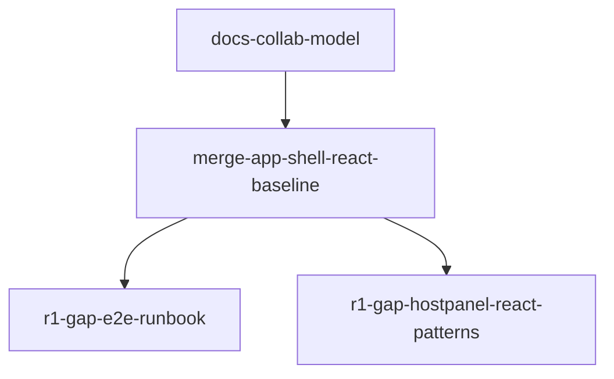

# R1 TaskPacket 队列（调度入口）

> **调度者用法**：对任意 Agent 只需发送一句话：  
> “先读 `docs/development/agent-playbook.md` 里你的角色章节；然后按 `docs/development/taskpackets/r1-queue.md` 中的 `<id>` TaskPacket 执行。”
>
> **默认顺序**：先做 **基线合并**，再做文档治理与小修复。并行仅在 **无文件冲突** 时允许。

---

## 依赖顺序（R1）



---

## TaskPackets

### docs-collab-model

```text
id: docs-collab-model
r_tier: R1
target_role: Implement
goal: 将“仅 Planner + Implement、分支交付、无 PR/Review/Explore”的协作说明落盘到 docs，并作为后续任务的统一入口。
scope_paths:
  - docs/development/agent-playbook.md
  - docs/development/taskpackets/r1-queue.md
  - docs/roadmap/release-targets.md
  - docs/roadmap/overview.md
  - docs/agent-handoff/from-lead.md
forbidden:
  - 修改 apps/、services/、packages/ 下任何实现代码
  - 改写 roadmap 的阶段目标（仅允许补充链接/入口）
acceptance:
  - 推送到 `task/docs-collab-model` 分支
  - pnpm lint
design_refs: N/A
base_branch: origin/main
notes: 本包只做文档“协议落盘”，为后续大合并与实现包提供稳定入口。
```

### merge-app-shell-react-baseline

```text
id: merge-app-shell-react-baseline
r_tier: R1
target_role: Implement
goal: 将 React app-shell + 当前交付主线并入 origin/main，解决冲突并使 CI 全绿。
scope_paths:
  - "**"（仅限合并产生的冲突文件及为通过 CI 所必需的最小修正；禁止夹带新功能）
forbidden:
  - 修改 packages/event-contracts 或 docs/protocols/ 中的契约语义（冲突时优先保持与现有协议一致，必要时回退到 Planner）
  - 引入 Ant Design、MUI、shadcn 等重型 UI 库
  - 合并之外的「顺手重构」或大范围格式化
acceptance:
  - 基于 origin/main 与 refactor/app-shell-react-and-design-spec（或调度者指定等价分支）完成合并，并推送到 `task/merge-app-shell-react-baseline` 分支
  - 本地执行与 CI 对齐：
    pnpm install --frozen-lockfile
    pnpm typecheck
    pnpm lint
    pnpm build
    pnpm --filter @the-damn-life/sync-service test
    pnpm sync:smoke
    ( cd services/relay-go && go test ./... )
    ( cd services/runtime-py && python -m pip install -q \"pytest>=8.0\" && python -m pytest -q )
    pnpm e2e
  - 交付回报包含：分支名 + 上述命令的结果摘要（失败则附关键错误输出与下一步计划）
design_refs: N/A
base_branch: origin/main
notes: 当前交付主线在 refactor/app-shell-react-and-design-spec；Implement 只做合并解析 + 通过 CI 所需的最小修复。
```

### r1-gap-e2e-runbook

```text
id: r1-gap-e2e-runbook
r_tier: R1
target_role: Implement
goal: 提供一页可重复的 R1 验收说明（脚本 + 关键手工步骤），补齐「能照着做」的闭环。
scope_paths:
  - docs/development/** 或 docs/runbooks/**（择一新建，例如 docs/development/r1-verification.md）
  - README.md（仅可增加「R1 验收」短链一节，3～8 行）
forbidden:
  - 修改 e2e/sync 脚本行为（除非发现与文档不一致的 bug，则另开包）
acceptance:
  - 文档列出：前置依赖、与 scripts/e2e-smoke.ts / sync-history-smoke 对齐的命令、常见失败排查入口
  - README 链到该文档
  - pnpm lint
design_refs: docs/development/ai-vibe-coding-guide.md（测试规范）；app-shell-design-spec.md N/A
base_branch: origin/main
notes: 可与文档包并行，仅当 README 没有冲突。
```

### r1-gap-hostpanel-react-patterns

```text
id: r1-gap-hostpanel-react-patterns
r_tier: R1
target_role: Implement
goal: 将 HostPanel 中随 roleKey 同步 relayUrl 的副作用移出 render，符合项目 React 约定且行为不变。
scope_paths:
  - apps/app-shell/platform/web/components/HostPanel.tsx
forbidden:
  - 改变 URL 构建语义、localStorage 键名或 connect 参数契约
  - 引入新 UI 库
acceptance:
  - pnpm lint、pnpm typecheck、pnpm build（或 turbo 覆盖 app-shell 的等价命令）
  - 无 render 路径上的 setState；ESLint 通过
design_refs: docs/development/app-shell-design-spec.md §组件；docs/development/ai-vibe-coding-guide.md（React/副作用）
base_branch: origin/main
notes: 仅做最小重构以移除 render 内 setState；行为保持一致。
```

