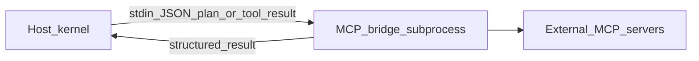

# MCP 技术验证（Spike，不进默认 gate）

## 目标

在 **不引入重型 npm 依赖到宿主内核** 的前提下，验证「Model Context Protocol」类工具能否作为 **侧车进程** 接入：内核仍只接受 **已 schema 化的 TaskPlan** 与现有 **审批 / 审计** 模型。

## 推荐架构草图

## 最小 PoC 步骤（手工）

1. 在独立目录或 `tools/` 下用官方 MCP SDK（Node）起一个 **stdio 桥**，暴露 1 个只读 tool（例如 `list_allowed_roots`）。
2. 宿主侧 **不** 直接 `import` MCP SDK；用 `spawn("node", ["bridge.js"], { stdio: ["pipe", "pipe", "inherit"] })` 发一条请求，超时与输出大小限额硬编码。
3. 将桥输出映射为 **审计中的一条** `planned` / `tool_probe` 事件（若进入产品化再定 schema）。

## 风险与约束

- MCP 生态与许可证多样；默认发行包 **不包含** MCP 运行时。
- 与 `DAMN_LIFE_REQUIRE_WS_TOKEN` 同哲学：**默认不信任、可关可审**。

## 下一步（产品化时）

- 新增 `taskType` 或独立「工具调用」记录前，先更新 [`mvp_scope_v1_0.md`](mvp_scope_v1_0.md) 与 red-team gate。
