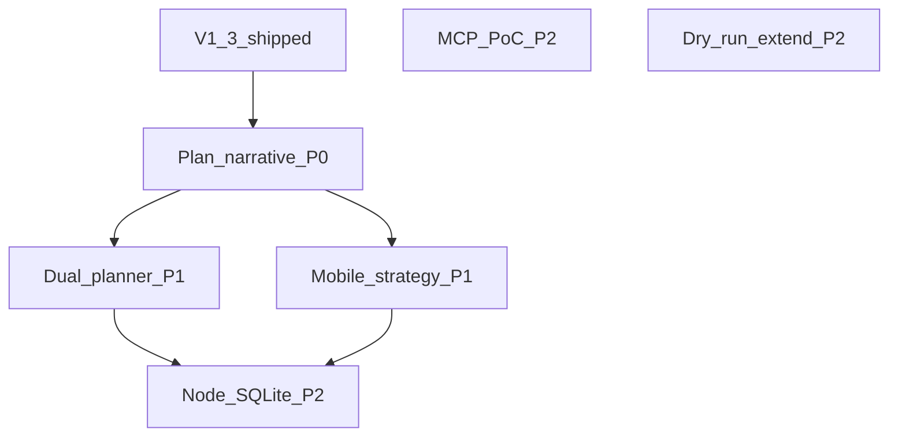

# The Damn Life 项目计划书 V1.4

> **上一版**：[`project_plan_v1_3.md`](project_plan_v1_3.md)  
> **修订日期**：2026-03-28  
> **结论**：V1.3 已把信任与可交付形态（干跑预览、strict smoke、InferenceProvider、MVP V1.0 冻结、MCP 文档 spike）落地；宿主 **再减重边际仍小**。V1.4 以 **研究项可验收化**、**移动端策略**、**可选存储迁移调研**、**MCP 可运行 PoC** 为主线，不重复 V1.1–V1.3 的 lean 内核叙事。

---

## 1. 与 [`docs/mvp_scope_v1_0.md`](../docs/mvp_scope_v1_0.md) 的关系

- **默认**：本计划中的里程碑均为 **V1.x 路线图**，不自动扩大 V1.0 对用户承诺；若某能力要进入「承诺范围」，须 **修订 `mvp_scope_v1_0.md` In/Out Scope** 并更新红队门禁与 e2e。
- **锚点**：当前对外能力边界仍以 V1.0 冻结文档为准；计划书描述 **下一步工程与产品创新**，与 MVP 文档 **互链维护**。

---

## 2. 里程碑与验收（建议优先级）

### P0 — 计划书与仓库叙事一致

| 项 | 验收 |
|----|------|
| 版本链 | `README` / `project_plan_v1_2` / `v1_3` / `v1_4` 中「当前推荐计划」指向一致；V1.2 backlog 对 V1.3 已关闭项有标注。 |

### P1 — 双规划器一致性（研究 → 可演示 PoC）

| 项 | 说明 | 验收 |
|----|------|------|
| 规则 | 对 `riskLevel === high`（或配置开关）可选 **第二规划路径**（不同模型或纯规则），结果不一致时 **不执行** 或 **强制二次确认**（具体策略需与 [`host/src/taskPlan.ts`](../host/src/taskPlan.ts) 一致）。 | 单元或集成测试覆盖「不一致」分支；文档一句话说明产品语义。 |
| 边界 | 不增加宿主重型框架；推理仍经 [`host/src/inferenceProvider.ts`](../host/src/inferenceProvider.ts) 或并行规则函数。 | `npm run check:gate` 仍通过；`kernelMetricsGate` 不放宽。 |

### P1 — 移动端体积策略（二选一或分阶段）

| 项 | 说明 | 验收 |
|----|------|------|
| A. 分析 | `vite build` 报告 + 与现有 [`host/src/mobileMetricsGate.ts`](../host/src/mobileMetricsGate.ts)（或等价脚本）对齐阈值。 | 文档记录 gzip 基线与优化前后对比（可仅主 bundle）。 |
| B. Preact | 评估迁移成本与收益；若迁移，保持 PWA/WS 行为不变。 | `npm run build -w mobile` + `check:gate:mobile` 通过；smoke 手动或 e2e 通过。 |

### P2 — Node 内置 SQLite（调研 → go/no-go）

| 项 | 说明 | 验收 |
|----|------|------|
| 调研 | Node 版本政策、API 稳定性、与 `better-sqlite3` 行为差异（同步/异步、性能）。 | `docs/` 或本计划附录 **ADR 式结论**：迁移 / 不迁移 + 理由。 |
| 若 go | 单独里程碑；全量迁移 + `weeklyGate` / `auditChainVerify` / 性能烟测。 | 不作为 V1.4 默认交付，避免与功能冲刺混做。 |

### P2 — MCP 子进程最小可运行 PoC

| 项 | 说明 | 验收 |
|----|------|------|
| 实现 | 在 [`docs/mcp_spike.md`](../docs/mcp_spike.md) 思路上，`spawn` + stdio **不** 将 MCP SDK 打入宿主 `dependencies`；超时与输出大小限额硬编码。 | 手工步骤可复现；**不进** 默认 `npm run check:gate`。 |
| 审计 | 若产生事件，与现有审计模型对齐（可先记 `tool_probe` 类草案）。 | 代码审查 + 文档记录约束。 |

### P2（可选）— 干跑预览扩展

| 项 | 说明 | 验收 |
|----|------|------|
| 新 taskType | 在 lean 内核前提下，对其它高副作用任务提供只读预览（需 schema + red team 扩展）。 | 与 `mvp_scope_v1_0` 同步；红队用例增量。 |

---

## 3. 创新点（一句话）

- **双规划器**：把「模型不一致」变成 **可执行前闸口**，而非再堆一个聊天窗口。  
- **干跑扩展**：同一套「可核对操作表」叙事延伸到更多任务类型。  
- **MCP PoC**：证明 **侧车进程** 可接入而不污染 lean 宿主依赖图。  
- **多推理后端**：继续在 [`inferenceProvider.ts`](../host/src/inferenceProvider.ts) 上扩展分支（含未来光学叙事）。

---

## 4. 依赖关系（简图）

---

## 5. 下一版预留（V1.5+）

- 浏览器扩展深度能力、多设备同步、Skill 商店等仍 **不在** 本计划范围（与 `mvp_scope_v1_0` Out of Scope 一致）。

---

*以 issue/里程碑跟踪；脚本名以仓库根目录 [`package.json`](../package.json) 为准。*
